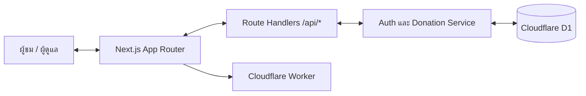
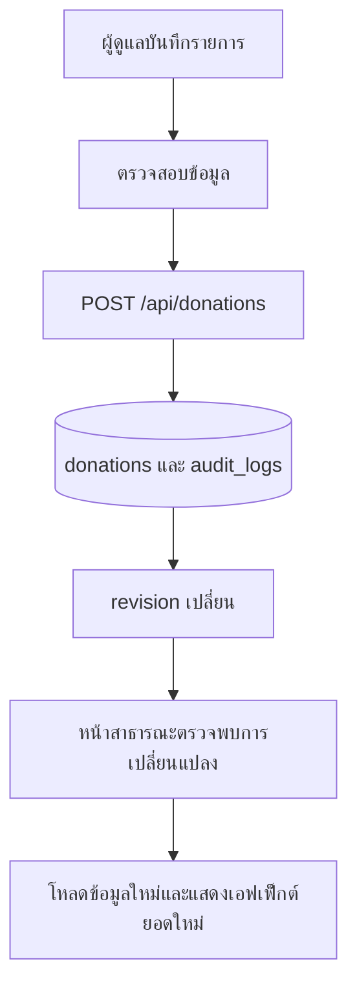
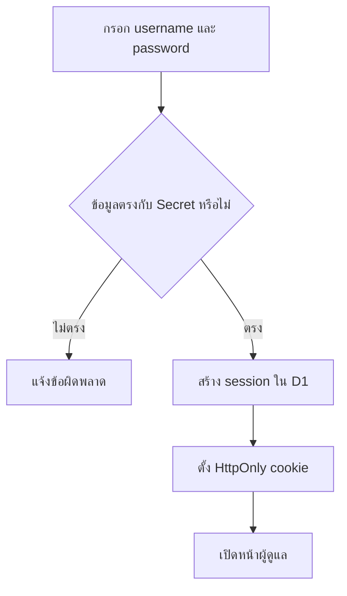

# 📘 คู่มือการใช้งานระบบนับยอดผ้าป่า โรงเรียนจอมทอง

เอกสารฉบับนี้จัดทำขึ้นเพื่อเป็นคู่มือใช้งาน ดูแลระบบ และอ้างอิงทางเทคนิคของระบบนับยอดผ้าป่าโรงเรียนจอมทอง โดยอธิบายลำดับการทำงาน การรักษาความปลอดภัย การพิมพ์รายงาน และการติดตั้งบน Cloudflare Workers อย่างเป็นระบบ

- เว็บไซต์ใช้งานจริง: [https://chomthong-phapa.doitgict.workers.dev](https://chomthong-phapa.doitgict.workers.dev)
- Runtime: Cloudflare Workers
- ฐานข้อมูล: Cloudflare D1
- Frontend: Next.js + TypeScript + Tailwind CSS

## 🌐 1. ภาพรวมของระบบ

ระบบนับยอดผ้าป่าเป็นเว็บแอปพลิเคชันสำหรับบันทึก สรุป และเผยแพร่ยอดผ้าป่าของโรงเรียนจอมทองแบบทันที โดยมีความสามารถหลักดังนี้

- ✅ แสดงยอดรวมและรายการผ้าป่าสำหรับบุคคลทั่วไป
- ✅ บันทึก แก้ไข และลบรายการสำหรับผู้ดูแลระบบ
- ✅ ตรวจข้อมูลใหม่ทุก 5 วินาที และอัปเดตเมื่อพบการเปลี่ยนแปลง
- ✅ แสดงเอฟเฟ็กต์ฉลองเมื่อมียอดใหม่เข้ามา
- ✅ พิมพ์รายงาน A4 แนวตั้ง หรือบันทึกเป็น PDF
- ✅ เก็บประวัติผู้ดำเนินการทุกครั้งที่เพิ่ม แก้ไข หรือลบข้อมูล
- ✅ รองรับมือถือ แท็บเล็ต และคอมพิวเตอร์

## 🎯 2. เป้าหมายของระบบ

ระบบนี้ออกแบบมาเพื่อแก้ปัญหาหลักดังต่อไปนี้

1. ลดการรวมยอดด้วยมือและลดความผิดพลาดในการคำนวณ
2. ให้ผู้ร่วมงานและผู้สนใจเห็นยอดล่าสุดได้จากหน้าเดียว
3. ให้ผู้ดูแลบันทึกข้อมูลได้รวดเร็ว พร้อมตรวจสอบย้อนหลังได้
4. จัดทำรายงานสำหรับพิมพ์หรือส่งต่อได้ทันที
5. แยกสิทธิ์การดูข้อมูลสาธารณะออกจากสิทธิ์แก้ไขข้อมูลอย่างชัดเจน

## 👥 3. บทบาทผู้ใช้งาน

ระบบรองรับ 2 รูปแบบการใช้งาน

### 🌍 3.1 ผู้ชมหน้าสาธารณะ

สิทธิ์หลัก:

- ดูยอดผ้าป่ารวมทั้งหมด
- ดูจำนวนรุ่นและจำนวนรายการ
- ดูรายการผ้าป่าล่าสุด
- เห็นการอัปเดตสดเมื่อมีข้อมูลใหม่

ผู้ชมทั่วไปไม่สามารถเพิ่ม แก้ไข ลบรายการ หรือเปิดรายงานสำหรับพิมพ์ได้

### 👑 3.2 ผู้ดูแลระบบ `admin`

บัญชีผู้ดูแลที่กำหนดไว้:

- `cboonta` — นายชลนที บุญทา
- `ppziyunzan` — นางสาวนิตติญา ลอดทองสี

สิทธิ์หลัก:

- บันทึกรายการผ้าป่า
- แก้ไขและลบรายการ
- ค้นหารายการย้อนหลัง
- เปิดดูหน้าสาธารณะโดยไม่ต้องออกจากระบบ
- เปิดพรีวิวและพิมพ์รายงาน A4

> ห้ามบันทึกรหัสผ่านจริงไว้ใน README, Git หรือแชตสาธารณะ รหัสผ่านเก็บเป็น Cloudflare Secrets เท่านั้น

## 🗺️ 4. หน้าใช้งานหลักของระบบ

### 🏠 4.1 หน้าหลัก `/`

- แสดงยอดผ้าป่ารวม
- แสดงรายการล่าสุด
- ปุ่มเข้าสู่ระบบสำหรับผู้ดูแล
- ตรวจการเปลี่ยนแปลงข้อมูลแบบเบา ๆ ทุก 5 วินาที

### 🛠️ 4.2 หน้าผู้ดูแล `/`

หลังเข้าสู่ระบบ หน้าเดียวกันจะเปลี่ยนเป็นหน้าผู้ดูแล และมี 2 เมนูหลัก

- `บันทึกข้อมูล` สำหรับเพิ่มหรือแก้ไขรายการ
- `สถิติและจัดการ` สำหรับค้นหา แก้ไข ลบ และเปิดรายงาน

### 🖨️ 4.3 หน้ารายงาน `/report`

- เปิดได้เฉพาะผู้ที่มี session ผู้ดูแล
- เปิดในแท็บใหม่เพื่อพรีวิวก่อนพิมพ์
- ใช้กระดาษ A4 แนวตั้ง
- หัวตารางจะแสดงซ้ำเมื่อรายการยาวเกินหนึ่งหน้า
- มีช่องลงชื่อท้ายรายงาน

### 🔌 4.4 API ภายใน

| เส้นทาง | วิธี | หน้าที่ | สิทธิ์ |
|---|---|---|---|
| `/api/auth/session` | `GET` | ตรวจ session ปัจจุบัน | สาธารณะ |
| `/api/auth/session` | `POST` | เข้าสู่ระบบ | สาธารณะ |
| `/api/auth/session` | `DELETE` | ออกจากระบบ | ผู้ดูแล |
| `/api/donations` | `GET` | อ่านยอดและรายการทั้งหมด | สาธารณะ |
| `/api/donations` | `POST` | เพิ่มรายการ | ผู้ดูแล |
| `/api/donations/[id]` | `PUT` | แก้ไขรายการ | ผู้ดูแล |
| `/api/donations/[id]` | `DELETE` | ลบรายการ | ผู้ดูแล |
| `/api/donations/changes` | `GET` | ตรวจ revision ของข้อมูล | สาธารณะ |

## 🔐 5. การเข้าสู่ระบบ

1. เปิดหน้าหลักของระบบ
2. กดปุ่ม `เข้าแอดมิน`
3. กรอกชื่อผู้ใช้และรหัสผ่าน
4. เมื่อสำเร็จ ระบบจะแสดงชื่อของผู้ดูแลที่เข้าสู่ระบบ
5. session มีอายุ 12 ชั่วโมง

หมายเหตุ:

- การกด `หน้าหลัก` ขณะเป็นแอดมิน คือการดูหน้าสาธารณะเท่านั้น ไม่ได้ออกจากระบบ
- การออกจากระบบต้องกดปุ่ม `ออกจากระบบ`
- cookie เป็น `HttpOnly` และ `SameSite=Strict` เพื่อลดความเสี่ยงจากการใช้งานข้ามเว็บไซต์

## 🧱 6. โครงสร้างสถาปัตยกรรมระบบ

### 🏗️ 6.1 โครงสร้างระดับสูง



### 🔄 6.1.1 การไหลของข้อมูล



### 🔩 6.2 ส่วนประกอบหลัก

- `Frontend` — Next.js App Router สำหรับหน้าสาธารณะ ผู้ดูแล และรายงาน
- `Backend API` — Route Handlers ใน `app/api`
- `Authentication` — cookie session แบบ server-side
- `Business Logic` — `lib/auth.ts` และ `lib/donations.ts`
- `Database` — Cloudflare D1
- `Deployment` — OpenNext Cloudflare สร้าง Worker และ assets

### 🧩 6.3 โมดูลหลักของระบบ

- `โมดูลยอดผ้าป่า` อ่านยอดรวม จำนวนรุ่น จำนวนรายการ และรายการล่าสุด
- `โมดูลผู้ดูแล` login, logout, CRUD และค้นหารายการ
- `โมดูลติดตามการเปลี่ยนแปลง` ตรวจ revision โดยไม่โหลดข้อมูลเต็มซ้ำ
- `โมดูลเอฟเฟ็กต์ยอดใหม่` แสดงตัวเลขไหล เหรียญ และพลุเฉพาะหน้าสาธารณะ
- `โมดูลรายงาน` พรีวิว พิมพ์ และบันทึก PDF
- `โมดูลตรวจสอบย้อนหลัง` เก็บ audit log ทุกการเปลี่ยนแปลง

### 🗄️ 6.4 ตารางฐานข้อมูลหลัก

- `campaigns` เก็บข้อมูลกองผ้าป่า ปัจจุบันใช้รหัส `main`
- `donations` เก็บรายการผ้าป่า
- `admin_sessions` เก็บ session ของผู้ดูแลบน server
- `audit_logs` เก็บประวัติเพิ่ม แก้ไข และลบข้อมูล
- `d1_migrations` เก็บสถานะ migration ที่ D1 จัดการให้

### 📚 6.5 Data Dictionary

#### 🏳️ ตาราง `campaigns`

| ฟิลด์ | ความหมาย |
|---|---|
| `id` | รหัสกองผ้าป่า เช่น `main` |
| `name` | ชื่อกองผ้าป่า |
| `event_date` | วันจัดงาน ถ้ามี |
| `is_active` | สถานะเปิดใช้งาน |
| `created_at` | วันเวลาสร้าง |

#### 💰 ตาราง `donations`

| ฟิลด์ | ความหมาย |
|---|---|
| `id` | รหัสรายการ UUID |
| `campaign_id` | อ้างถึงกองผ้าป่า |
| `batch_number` | รุ่นที่ |
| `batch_name` | ชื่อรุ่นหรือกลุ่ม |
| `amount` | จำนวนเงิน ต้องมากกว่า 0 |
| `note` | หมายเหตุ |
| `received_at` | วันเวลารับเงิน |
| `created_at` | วันเวลาสร้างรายการ |
| `updated_at` | วันเวลาแก้ไขล่าสุด |

#### 🔐 ตาราง `admin_sessions`

| ฟิลด์ | ความหมาย |
|---|---|
| `id` | รหัส session UUID |
| `expires_at` | เวลาหมดอายุ session |
| `username` | ชื่อผู้ใช้ของผู้ดูแล |
| `display_name` | ชื่อที่ใช้แสดงในระบบ |
| `created_at` | วันเวลาสร้าง session |

#### 🧾 ตาราง `audit_logs`

| ฟิลด์ | ความหมาย |
|---|---|
| `id` | รหัส audit UUID |
| `donation_id` | รายการผ้าป่าที่เกี่ยวข้อง |
| `action` | `create`, `update` หรือ `delete` |
| `snapshot` | ข้อมูลก่อน/หลังการเปลี่ยนแปลงแบบ JSON |
| `actor_username` | username ผู้ดำเนินการ |
| `actor_name` | ชื่อผู้ดำเนินการ |
| `created_at` | วันเวลาทำรายการ |

### 📁 6.6 โครงสร้างโค้ดหลัก

```text
app/
  api/                 API สำหรับ auth และ donations
  report/              หน้าพรีวิวและปุ่มพิมพ์รายงาน
  globals.css          Tailwind และ CSS ของเอฟเฟ็กต์/รายงาน
  layout.tsx           metadata, font และ favicon
  page.tsx             หน้าสาธารณะและหน้าผู้ดูแล
lib/
  auth.ts              session และ credentials จาก environment
  donations.ts         CRUD, summary และ audit log
  types.ts             TypeScript types
migrations/            D1 schema migrations
public/img/logo.png    โลโก้โรงเรียน
wrangler.jsonc         Cloudflare Worker และ D1 binding
```

## 🔄 7. กระบวนการทำงานของระบบ

### 🔐 7.1 การเข้าสู่ระบบ



### 💵 7.2 การบันทึกรายการผ้าป่า

1. ผู้ดูแลเปิดเมนู `บันทึกข้อมูล`
2. กรอก `รุ่นที่`, `ชื่อรุ่น / กลุ่ม`, `จำนวนเงิน` และหมายเหตุ
3. ระบบตรวจว่าข้อมูลครบ และจำนวนเงินมากกว่า 0
4. บันทึกลง `donations`
5. บันทึกผู้ดำเนินการลง `audit_logs`
6. หน้าสาธารณะจะตรวจพบ revision ใหม่และโหลดข้อมูลใหม่

### ✏️ 7.3 การแก้ไขและลบรายการ

1. ผู้ดูแลเปิด `สถิติและจัดการ`
2. ค้นหารายการที่ต้องการ
3. กดแก้ไขหรือกดลบ
4. ระบบตรวจ session ก่อนทุกคำขอ
5. ระบบบันทึก snapshot และชื่อผู้ดำเนินการใน audit log

### ✨ 7.4 การอัปเดตแบบสด

1. หน้าสาธารณะเรียก `/api/donations/changes` ทุก 5 วินาที
2. API ส่งค่า revision ที่ประกอบจากจำนวนรายการและเวลาแก้ไขล่าสุด
3. ถ้า revision ไม่เปลี่ยน ระบบไม่โหลดข้อมูลเต็มซ้ำ
4. ถ้า revision เปลี่ยน ระบบโหลดข้อมูลใหม่ทันที
5. ถ้ายอดเพิ่ม ระบบแสดงเอฟเฟ็กต์ยอดใหม่ประมาณ 6 วินาที และตัวเลขไหล 2 วินาที

### 🖨️ 7.5 การพิมพ์รายงาน

1. เข้าสู่ระบบผู้ดูแล
2. เปิด `สถิติและจัดการ`
3. กด `พิมพ์รายงาน`
4. ระบบเปิด `/report` ในแท็บใหม่เพื่อพรีวิว
5. กด `พิมพ์รายงาน / บันทึก PDF`
6. เลือกเครื่องพิมพ์หรือ `Save as PDF`

รายงานเป็น A4 แนวตั้ง และใช้ `table-header-group` เพื่อให้หัวตารางขึ้นซ้ำเมื่อมีหลายหน้า

## 👑 8. คู่มือสำหรับผู้ดูแลระบบ

### 🚀 8.1 สิ่งที่ควรตรวจหลัง login

1. ตรวจชื่อผู้ดูแลที่แสดงบนหัวเว็บ
2. ตรวจยอดรวม จำนวนรุ่น และจำนวนรายการ
3. เปิดหน้าหลักเพื่อดูว่าตารางสาธารณะแสดงผลถูกต้อง
4. ตรวจว่าเมนู `สถิติและจัดการ` ค้นหารายการได้

### ➕ 8.2 การเพิ่มรายการ

1. เปิดแท็บ `บันทึกข้อมูล`
2. กรอกข้อมูลให้ครบ
3. กด `บันทึกรายการ`
4. รอ toast ยืนยัน
5. ตรวจยอดจากหน้าหลักได้ทันที

### 📝 8.3 การแก้ไขรายการ

1. เปิดแท็บ `สถิติและจัดการ`
2. ใช้ช่องค้นหา
3. เลือกรายการและกดแก้ไข
4. ปรับข้อมูลแล้วกด `บันทึกการแก้ไข`

### 🗑️ 8.4 การลบรายการ

1. ค้นหารายการจากหน้าจัดการ
2. กดลบและตรวจชื่อ/ยอดเงินให้ถูกต้อง
3. ยืนยันการลบ
4. ระบบเก็บ snapshot ก่อนลบไว้ใน `audit_logs`

### 📊 8.5 การพิมพ์รายงาน

- รายงานเปิดเป็นแท็บใหม่เพื่อให้ตรวจสอบก่อนพิมพ์
- รายงานเปิดได้เฉพาะผู้ดูแลที่ login แล้ว
- หัวตารางซ้ำเมื่อเกินหน้า A4
- ช่องลงชื่อท้ายรายงานประกอบด้วยผู้อำนวยการ ผู้ช่วยผู้อำนวยการกลุ่มงานบัญชีและการเงิน และหัวหน้างาน

## 🌍 9. คู่มือสำหรับผู้ชมหน้าสาธารณะ

### 🏠 9.1 การดูยอดล่าสุด

1. เปิดเว็บไซต์หลัก
2. ดูยอดรวมจากการ์ดด้านบน
3. เลื่อนดูรายการผ้าป่าจากตาราง
4. ระบบอัปเดตเองเมื่อมีข้อมูลใหม่ ไม่ต้องรีเฟรชหน้า

### 🔔 9.2 เมื่อมียอดใหม่

- ตัวเลขยอดรวมจะเคลื่อนไหวอย่างนุ่มนวล
- มีเหรียญ พลุ และข้อความขอบคุณแสดงบนหน้าหลัก
- เอฟเฟ็กต์มีไว้เพื่อสื่อว่าระบบตรวจพบยอดใหม่ ไม่กระทบข้อมูลจริง

## 🧰 10. คู่มือสำหรับผู้ดูแลเชิงเทคนิค

### 🗃️ 10.1 Environment variables และ Secrets

สร้าง `.dev.vars` สำหรับการพัฒนาในเครื่อง โดยห้าม commit ไฟล์นี้

```dotenv
NEXTJS_ENV=development
ADMIN_USERNAME=your_admin_username
ADMIN_PASSWORD=your_secure_password
ADMIN_DISPLAY_NAME="ชื่อผู้ดูแลคนที่ 1"
ADMIN2_USERNAME=your_second_admin_username
ADMIN2_PASSWORD=your_second_secure_password
ADMIN2_DISPLAY_NAME="ชื่อผู้ดูแลคนที่ 2"
```

บน Cloudflare ต้องอัปโหลดเป็น secret:

```bash
npx wrangler secret bulk .dev.vars
```

### 🧬 10.2 Migrations

ระบบมี migrations 3 ชุด:

1. `0001_initial.sql` สร้าง campaigns, donations และ audit_logs
2. `0002_admin_sessions.sql` สร้าง admin_sessions
3. `0003_admin_identity_audit.sql` เพิ่มชื่อผู้ดูแลใน session และ audit log

## 🧑‍💼 11. คู่มือสำหรับผู้ตรวจรายงาน / ผู้บริหาร

1. ขอให้ผู้ดูแลเข้าสู่ระบบก่อน
2. เปิด `สถิติและจัดการ`
3. กด `พิมพ์รายงาน`
4. ตรวจยอดรวม รายการ และวันเวลาบนหน้าพรีวิว
5. พิมพ์ A4 หรือบันทึก PDF

> ไม่ควรแชร์ session หรือรหัสผ่านให้บุคคลอื่น หากต้องการให้ผู้บริหารดูข้อมูล ให้เปิดหน้าสาธารณะหรือสร้างบัญชีผู้ดูแลแยกตามนโยบายของโรงเรียน

## 🧪 12. การติดตั้งและทดสอบบนเครื่อง

### 📦 12.1 ติดตั้ง dependencies

```bash
npm install
```

### 🗄️ 12.2 ติดตั้งฐานข้อมูล D1 ในเครื่อง

```bash
npx wrangler d1 migrations apply pha-pha-counter-db --local
```

### 🚀 12.3 รันระบบ

```bash
npm run dev
```

เปิด [http://localhost:3000](http://localhost:3000)

### ✅ 12.4 ตรวจสอบก่อนส่งงาน

```bash
npm run lint
npm run build
npm run preview
```

## ☁️ 13. Deploy บน Cloudflare Workers

### 🔧 13.1 ทรัพยากรที่ใช้จริง

- Worker: `chomthong-phapa`
- D1 binding: `DB`
- D1 database ปัจจุบัน: `pha-pha-counter-db`
- URL: `https://chomthong-phapa.doitgict.workers.dev`

### 🚀 13.2 ลำดับ Deploy

```bash
# 1) login Cloudflare
npx wrangler login

# 2) ใช้เมื่อมี migration ใหม่
npx wrangler d1 migrations apply pha-pha-counter-db --remote

# 3) อัปโหลด secrets เมื่อมีการเปลี่ยนบัญชีหรือรหัสผ่าน
npx wrangler secret bulk .dev.vars

# 4) build และ deploy Worker
npm run deploy
```

### 🧾 13.3 สร้าง TypeScript types ของ Cloudflare ใหม่

เมื่อเปลี่ยน binding ใน `wrangler.jsonc` ให้รัน:

```bash
npm run cf-typegen
```

## 🧪 14. ปัญหาที่พบบ่อย

### ❌ 14.1 login ไม่ได้

ให้ตรวจ:

1. username และ password ถูกต้องหรือไม่
2. ค่า `ADMIN_*` และ `ADMIN2_*` อยู่ใน `.dev.vars` หรือ Cloudflare Secrets ครบหรือไม่
3. หลังแก้ secret แล้วอาจต้องรอสักครู่ให้ Worker ใช้ค่าใหม่
4. session เดิมหมดอายุหรือถูกลบแล้วหรือไม่

### 👀 14.2 หน้าหลักไม่อัปเดต

ให้ตรวจ:

1. API `/api/donations/changes` ตอบ `200` หรือไม่
2. API `/api/donations` ตอบข้อมูลล่าสุดหรือไม่
3. ตรวจ D1 binding `DB` ใน `wrangler.jsonc`
4. รอรอบตรวจถัดไปไม่เกิน 5 วินาที หรือกดรีเฟรชหนึ่งครั้ง

### 🖨️ 14.3 เปิดรายงานไม่ได้

ให้ตรวจ:

1. login ผู้ดูแลอยู่หรือไม่
2. browser อนุญาตให้เปิดแท็บใหม่หรือไม่
3. หากเข้า `/report` โดยไม่มี session ระบบจะ redirect กลับหน้าหลัก ซึ่งเป็นพฤติกรรมปกติ

### 📄 14.4 หัวตารางไม่ซ้ำตอนพิมพ์

ให้ตรวจ:

1. ใช้ปุ่มพิมพ์จากหน้าพรีวิว `/report`
2. ตั้งค่ากระดาษเป็น A4 แนวตั้ง
3. ใช้ browser รุ่นปัจจุบัน เช่น Chrome หรือ Edge
4. อย่าคัดลอกตารางไปพิมพ์จากหน้าอื่น เพราะ CSS สำหรับพิมพ์อยู่เฉพาะหน้ารายงาน

### ☁️ 14.5 Deploy แล้วหน้าเว็บ error

ให้ตรวจ:

1. รัน `npm run build` ในเครื่องก่อน
2. ตรวจ D1 database ID ใน `wrangler.jsonc`
3. ตรวจว่ารัน remote migrations ครบแล้ว
4. ตรวจว่า secrets ถูกอัปโหลดให้ Worker ชื่อปัจจุบันแล้ว
5. เปิด Cloudflare Worker Logs เพื่อดู error เพิ่มเติม

## 💡 15. ข้อแนะนำก่อนใช้จริง

- ควรทดสอบ login ทั้งสองบัญชีก่อนวันใช้งานจริง
- ควรทดลองเพิ่ม แก้ไข ลบรายการ และตรวจยอดในหน้าสาธารณะ
- ควรทดลองพิมพ์รายงานเมื่อมีรายการมากกว่าหนึ่งหน้า A4
- ควรเปิดหน้าสาธารณะบนจอแสดงผล และเปิดหน้าผู้ดูแลในอุปกรณ์ที่แยกกัน
- ควรสำรอง D1 ก่อนแก้ schema หรือทำงานกับข้อมูลจำนวนมาก
- ควรจำกัดผู้ที่รู้รหัสผ่านแอดมิน และเปลี่ยนรหัสผ่านเมื่อมีการเปลี่ยนผู้รับผิดชอบ
- ไม่ควรแก้ยอดเงินโดยตรงด้วย SQL เพราะจะข้าม audit log; ให้แก้ผ่านหน้าผู้ดูแล

## ✅ 16. สรุป

ลำดับการใช้งานที่แนะนำมีดังนี้

1. เปิดหน้าสาธารณะเพื่อติดตามยอด
2. ผู้ดูแล login เพื่อบันทึกรายการ
3. ตรวจว่ายอดและรายการอัปเดตบนหน้าสาธารณะ
4. ใช้เมนูจัดการเมื่อจำเป็นต้องแก้ไขหรือลบรายการ
5. เปิดพรีวิวรายงานและพิมพ์ A4 หรือบันทึก PDF
6. สำรอง D1 และตรวจ Cloudflare Logs เป็นระยะ

เมื่อดำเนินการครบ ระบบจะพร้อมใช้งานสำหรับการนับยอดผ้าป่าแบบสดและมีรายงานอ้างอิงได้อย่างเป็นระบบ
